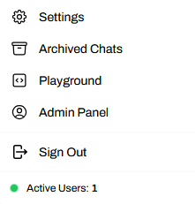
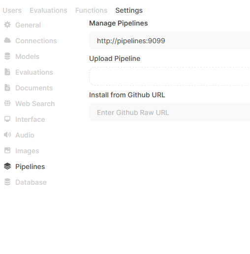
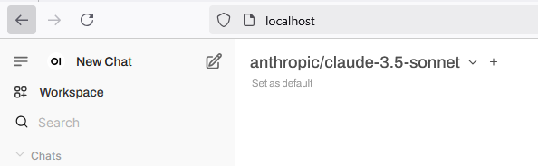

<div align="center">

# Open WebUI Deployment

[](LICENSE)
[](https://hub.docker.com/)

</div>

Deployment of local Open WebUI
---

# Installation

This deployment only requires docker to be installed. 

Please see installation instructions [here](https://docs.docker.com/engine/install/).

# Deployment

1. Clone this repository to your local workstation.

2. Review the `docker-compose.yaml` or `docker-compose-traefik.yaml` file, default traefik will use port 80. 

3. To deploy the Open WebUI service and the `pipeline`service:

```bash
docker compose up -d
```

For traefik deplyoment:
```bash
docker compose -f docker-compose-traefik.yaml up -d
```

Once completed, you can access the web service on `localhost/chat`

# Configuration

1. Create administrator user
    * The first user you register will be admin
    * This is a local user only, therefore you can use a dummy email (i.e. user@email.com)
    * Password stored locally.

2. Add API Keys

## Install required `pipeline` repositories

1. The list of providers are located on GitHub, [here](https://github.com/open-webui/pipelines/tree/main/examples/pipelines/providers).

2. Navigate to the administration panel, clicking on your username on the bottom left corner.



3. Navigate to settings > pipelines




4. Paste the required provider GitHub link into the "Install from GitHub URL" field.

For example, to use Anthropic API, paste `https://github.com/open-webui/pipelines/blob/main/examples/pipelines/providers/anthropic_manifold_pipeline.py`

5. The pipeline will install

6. Once completed, add the API key.

## Check Connectivity

Navigate back to the homepage, or `localhost` and check that you can see the provider models.



# Updating Open WebUI

To update Open WebUI you can use Watchtower:

`docker run --rm --volume /var/run/docker.sock:/var/run/docker.sock containrrr/watchtower --run-once open-webui`

Change `open-webui` if you have renamed the container.

## Issues with Service

This is unrelated to the `docker-compose` deployment, but an issue with the services.

1. API key seems to corrupt when service goes offline.
    * Current workaround is to re-import the keys.


